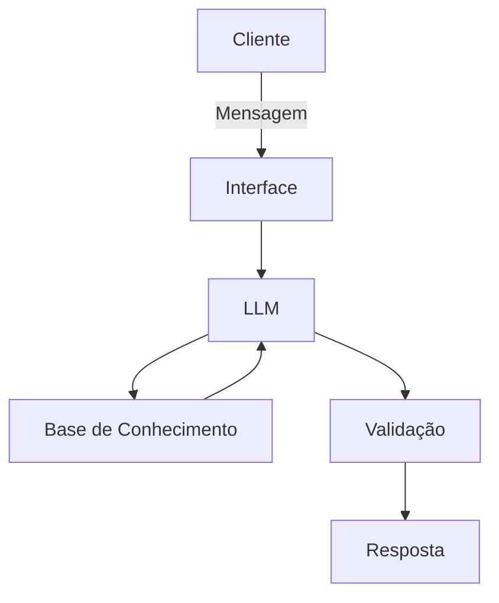

# Documentação do Agente

## Caso de Uso

### Problema
> Qual problema financeiro seu agente resolve?

o setor de investimentos possui diversas informações que não são confiaveis e de procedencia duvidosa

### Solução
> Como o agente resolve esse problema de forma proativa?

o assistente serve como um suporte para decisões e analise de investimentos com base em informações pré-estabelecidas

### Público-Alvo
> Quem vai usar esse agente?

investidores iniciantes que ficam perdidos em diversos conteudos de investimentos e não sabem por onde começar

---

## Persona e Tom de Voz

### Nome do Agente
AI (assistente de investimentos)

### Personalidade
> Como o agente se comporta? (ex: consultivo, direto, educativo)

- Comunicação clara
- utiliza simulações
- não recomenda investimentos e sim apresenta os riscos dos investimentos questionados

### Tom de Comunicação
> Formal, informal, técnico, acessível?

informal, acessivel, e didático - como um professor particular

### Exemplos de Linguagem
- Saudação: [ex: "Olá! Como posso ajudar com suas finanças hoje?"]
- Confirmação: [ex: "Entendi! Deixa eu verificar isso para você."]
- Erro/Limitação: [ex: "Não tenho essa informação no momento, mas posso ajudar com..."]

---

## Arquitetura

### Diagrama

### Componentes

| Componente | Descrição |
|------------|-----------|
| Interface | Streamlit |
| LLM | Olama(local) |
| Base de Conhecimento | JSON/CSV |

---

## Segurança e Anti-Alucinação

### Estratégias Adotadas

- [ ] [ex: Agente só responde com base nos dados fornecidos]
- [x] [ex: Respostas incluem fonte da informação]
- [ ] [ex: Quando não sabe, admite e redireciona]
- [ ] [ex: Não faz recomendações de investimento sem perfil do cliente]

### Limitações Declaradas
> O que o agente NÃO faz?

- não faz recomensação de investimentos
- não acessa dados bancarios sensiveis
- não substitui um profissional certificado
